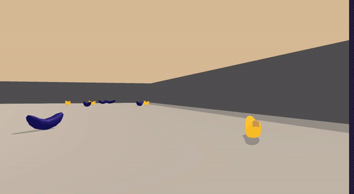
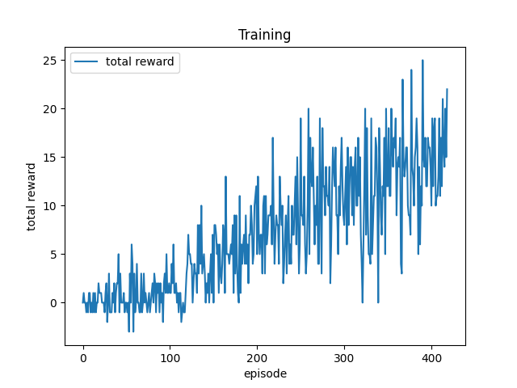

[//]: # (Image References)

# Project 1: Navigation

## Introduction

In this project, we will train an agent to navigate (and collect bananas!) in a large, square world.  

  

A reward of +1 is provided for collecting a yellow banana, and a reward of -1 is provided for collecting a blue banana.  Thus, the goal of our agent is to collect as many yellow bananas as possible while avoiding blue bananas.  

The state space has 37 dimensions and contains the agent's velocity, along with ray-based perception of objects around agent's forward direction.  Given this information, the agent has to learn how to best select actions.  Four discrete actions are available, corresponding to:
- **`0`** - move forward.
- **`1`** - move backward.
- **`2`** - turn left.
- **`3`** - turn right.

## Goal

The task is episodic, and in order to solve the environment, the agent must get an average score of +13 over 100 consecutive episodes.

## Downloads

1. Download or clone this repository `git clone https://github.com/ioarun/udacity-deep-reinforcement-learning.git`

If you are running a x86_64 linux machine as I'm doing, you can skip this step.

2. Download the environment from one of the links below.  You need only select the environment that matches your operating system:
    - Linux: [click here](https://s3-us-west-1.amazonaws.com/udacity-drlnd/P1/Banana/Banana_Linux.zip)
    - Mac OSX: [click here](https://s3-us-west-1.amazonaws.com/udacity-drlnd/P1/Banana/Banana.app.zip)
    - Windows (32-bit): [click here](https://s3-us-west-1.amazonaws.com/udacity-drlnd/P1/Banana/Banana_Windows_x86.zip)
    - Windows (64-bit): [click here](https://s3-us-west-1.amazonaws.com/udacity-drlnd/P1/Banana/Banana_Windows_x86_64.zip)
    
Unzip the file and place it in the `class-projects/p1_navigation/` folder, and unzip (or decompress) the file.

## Installation

1. Change the directory to `class-projects/p1_navigation/` using this command in the terminal - `cd class-projects/`
2. Install the dependencies by running the following command - `sh ./install.sh` 

## Usage

1. Train (default) - `python navigation.py` 
2. Test - `python navigation.py --test`
3. Render - To render the environment, `--render` can be added in the command line.
If you want to change any hyperparameters, you can change it in `constants.py`

## Results

  

