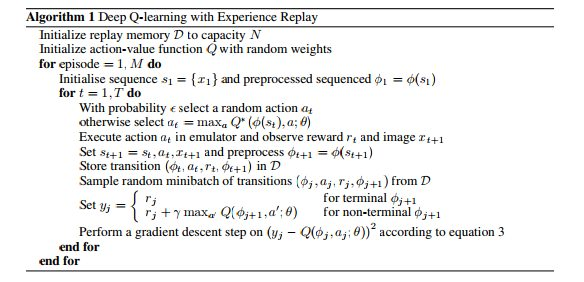
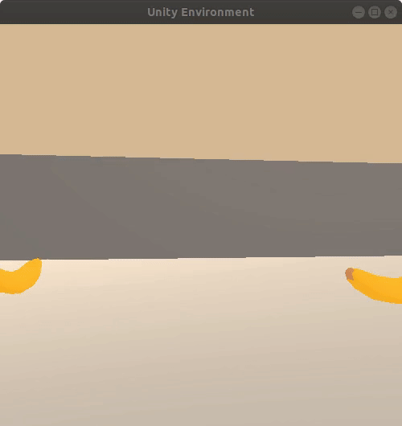
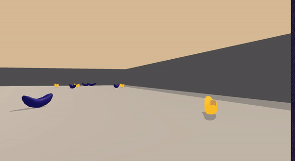

# Project Report

## About
A reward of +1 is provided for collecting a yellow banana, and a reward of -1 is provided for collecting a blue banana.  Thus, the goal of your agent is to collect as many yellow bananas as possible while avoiding blue bananas.  

The state space has 37 dimensions and contains the agent's velocity, along with ray-based perception of objects around agent's forward direction.  Given this information, the agent has to learn how to best select actions.  Four discrete actions are available, corresponding to:
- **`0`** - move forward.
- **`1`** - move backward.
- **`2`** - turn left.
- **`3`** - turn right.

The task is episodic, and in order to solve the environment, your agent must get an average score of +13 over 100 consecutive episodes.

## Goal
The task is episodic, and in order to solve the environment, your agent must get an average score of +13 over 100 consecutive episodes.

## Algorithm - Deep Q-Learning
<p align= "center">
  
</p>

**Reference** - *Mnih, Volodymyr, Koray Kavukcuoglu, David Silver, Alex Graves, Ioannis Antonoglou, Daan Wierstra, and Martin Riedmiller. "Playing atari with deep reinforcement learning." arXiv preprint arXiv:1312.5602 (2013).*

## Architecture
```
QNetwork(
  (fc1): Linear(in_features=37, out_features=128, bias=True)
  (fc2): Linear(in_features=128, out_features=64, bias=True)
  (output): Linear(in_features=64, out_features=4, bias=True)
)
```
## Constants & Hyperparams
```
ENV_PATH = 'Banana_Linux/Banana.x86_64'
CHECKPOINT_PATH = 'checkpoint/checkpoint.pth'
TRAINED_MODEL_PATH = 'trained_model/model.pth'

N_TRAIN_EPISODES = 5000
REPLAY_BUFFER_SIZE = 1e5
REWARD_BUFFER_SIZE = 100
BATCH_SIZE = 64
EPSILON = 1.0
EPSILON_DECAY = 0.99
EPSILON_MIN = 0.01
GAMMA = 0.99
LEARNING_RATE = 0.0005
TAU = 1e-3

UPDATE_MODELS_EVERY = 5 # every 5 time steps
SAVE_MODELS_EVERY = 10 # every 10 episodes

AVG_REWARD_FOR_SUCCESS = 13.0
N_TEST_EPISODES = 100

PLOT = True
```
## Training Log
```
Average reward after 100 episodes : 0.6 
Average reward after 200 episodes : 4.14 
Average reward after 300 episodes : 9.28 
Average reward after 400 episodes : 12.43 
Average Score: 13.04 Solved in 419 episodes!
Saving network models at episode 419
```
<p align= "center">
  
</p>

## Training curve
<p align= "center">
  
</p>


## Test output
<p align= "center">
  
</p>

## Conclusion
Deep Q-Learning agent was able to successfully the Banana Environent in 419 episodes.

