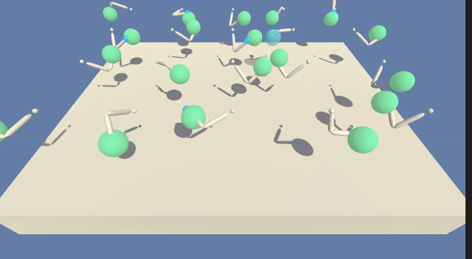

[//]: # (Image References)

# Project 2: Continuous Control
This project requires Python3 and PyTorch.

## Introduction

In this project, we train a reinforcement learning (RL) agent that controls a robotic arm within Unity's [Reacher](https://github.com/Unity-Technologies/ml-agents/blob/master/docs/Learning-Environment-Examples.md#reacher) environment. The goal is to get 20 different robotic arms to maintain contact with the green spheres.  


<p align= "center">
  
</p>


A reward of +0.1 is provided for each timestep that the agent's hand is in the goal location. Thus, the goal of your agent is to maintain its position at the target location for as many time steps as possible.  

The observation space consists of 33 variables corresponding to position, rotation, velocity, and angular velocities of the arm. Each action is a vector with four numbers, corresponding to torque applicable to two joints. Every entry in the action vector should be a number between -1 and 1.

The action space consists of 4 continuous actions, which describes the torque applicable to both joints.


### Solving the Environment

- After each episode, we add up the rewards that each agent received (without discounting), to get a score for each agent.  This yields 20 (potentially different) scores.  We then take the average of these 20 scores. 
- This yields an **average score** for each episode (where the average is over all 20 agents).

The environment is considered solved, when the average (over 100 episodes) of those average scores is at least +30. 

## Getting Started (for training 20 agents)

1. Download or clone this repository `git clone https://github.com/ioarun/udacity-deep-reinforcement-learning.git`

If you are running a x86_64 linux machine as I'm doing, you can skip this step.

2. Download the environment from one of the links below.  You need only select the environment that matches your operating system:
    - Linux: [click here](https://s3-us-west-1.amazonaws.com/udacity-drlnd/P2/Reacher/Reacher_Linux.zip)
    - Mac OSX: [click here](https://s3-us-west-1.amazonaws.com/udacity-drlnd/P2/Reacher/Reacher.app.zip)
    - Windows (32-bit): [click here](https://s3-us-west-1.amazonaws.com/udacity-drlnd/P2/Reacher/Reacher_Windows_x86.zip)
    - Windows (64-bit): [click here](https://s3-us-west-1.amazonaws.com/udacity-drlnd/P2/Reacher/Reacher_Windows_x86_64.zip)
    
Unzip the file and place it in the `class-projects/p2_continuous-control/` folder, and unzip (or decompress) the file.

## Installation 
1. Change the directory to `class-projects/p2_continuous-control/` using this command in the terminal - `cd class-projects/`
2. Install the dependencies by running the following command - `sh ./install.sh` 

## Usage

1. Test - `python reaching.py --render` 
2. Train - `python reaching.py --train`
3. Render - To render the environment, `--render` can be added in the command line.

**Note** - If you get following error during loading the models - `RuntimeError: cuda runtime error (35) : CUDA driver version is insufficient for CUDA runtime version at torch/csrc/cuda/Module.cpp:51
`, then do the following - 
```
if torch.cuda.is_available():
	map_location=lambda storage, loc: storage.cuda()
else:
	map_location='cpu'
torch.load(CHECKPOINT_PATH, map_location=map_location)
```

## Results

<p align= "center">
  
</p>


