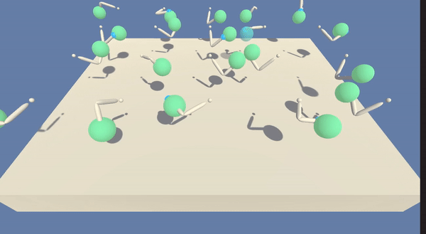

# Project Report

## About
A reward of +0.1 is provided for each timestep that the agent's hand is in the goal location. Thus, the goal of your agent is to maintain its position at the target location for as many time steps as possible.  

The observation space consists of 33 variables corresponding to position, rotation, velocity, and angular velocities of the arm. Each action is a vector with four numbers, corresponding to torque applicable to two joints. Every entry in the action vector should be a number between -1 and 1.

The action space consists of 4 continuous actions, which describes the torque applicable to both joints.

## Goal
The environment is considered solved, when the average (over 100 episodes) of those average scores is at least +30. 

## Algorithm - Deep Deterministic Policy Gradient (DDPG)
<p align= "center">
  
</p>

**Reference** - *“Continuous Control With Deep Reinforcement Learning” (Lillicrap et al, 2015)*

## Architecture
```
Actor(
  (fc1): Linear(in_features=33, out_features=400, bias=True)
  (bn1): BatchNorm1d(400, eps=1e-05, momentum=0.1, affine=True, track_running_stats=True)
  (fc2): Linear(in_features=400, out_features=300, bias=True)
  (fc3): Linear(in_features=300, out_features=4, bias=True)
)
Critic(
  (fcs1): Linear(in_features=33, out_features=400, bias=True)
  (bn1): BatchNorm1d(400, eps=1e-05, momentum=0.1, affine=True, track_running_stats=True)
  (fc2): Linear(in_features=404, out_features=300, bias=True)
  (fc3): Linear(in_features=300, out_features=1, bias=True)
)
```
## Constants & Hyperparams
```
BUFFER_SIZE = int(1e6)  # replay buffer size
BATCH_SIZE = 128        # minibatch size
GAMMA = 0.99            # discount factor
TAU = 1e-3              # for soft update of target parameters
LR_ACTOR = 1e-3         # learning rate of the actor
LR_CRITIC = 1e-3        # learning rate of the critic
WEIGHT_DECAY = 0        # L2 weight decay
LEARN_EVERY = 20        # learning timestep interval
LEARN_NUM = 10          # number of learning passes
OU_SIGMA = 0.2          # Ornstein-Uhlenbeck noise parameter
OU_THETA = 0.15         # Ornstein-Uhlenbeck noise parameter
EPSILON = 1.0           # explore->exploit noise process added to act step
EPSILON_DECAY = 1e-6    # decay rate for noise process
```
## Training Log
```
Episode 90 |    Mean: 38.8      Moving Avg: 27.5
Episode 91 |    Mean: 36.8      Moving Avg: 27.6
Episode 92 |    Mean: 37.5      Moving Avg: 27.7
Episode 93 |    Mean: 38.0      Moving Avg: 27.8
Episode 94 |    Mean: 37.1      Moving Avg: 27.9
Episode 95 |    Mean: 36.8      Moving Avg: 28.0
Episode 96 |    Mean: 37.5      Moving Avg: 28.1
Episode 97 |    Mean: 36.5      Moving Avg: 28.2
Episode 98 |    Mean: 36.8      Moving Avg: 28.3
Episode 99 |    Mean: 36.8      Moving Avg: 28.4
Episode 100 |   Mean: 37.6      Moving Avg: 28.5
Episode 101 |   Mean: 36.8      Moving Avg: 28.8
Episode 102 |   Mean: 35.6      Moving Avg: 29.2
Episode 103 |   Mean: 36.6      Moving Avg: 29.3
Episode 104 |   Mean: 35.8      Moving Avg: 29.5
Episode 105 |   Mean: 35.7      Moving Avg: 29.6
Episode 106 |   Mean: 36.4      Moving Avg: 29.7
Episode 107 |   Mean: 37.3      Moving Avg: 29.8
Episode 108 | 	Mean: 38.6		Moving Avg: 30.0
Environment SOLVED in 12 episodes!	Moving Average =30.0 over last 100 episodes

```

## Training curve
<p align= "center">
  
</p>


## Test output
<p align= "center">
  
</p>

## Conclusion
DDPG agent was able to successfully solve the Reacher Environent in 108 episodes.

