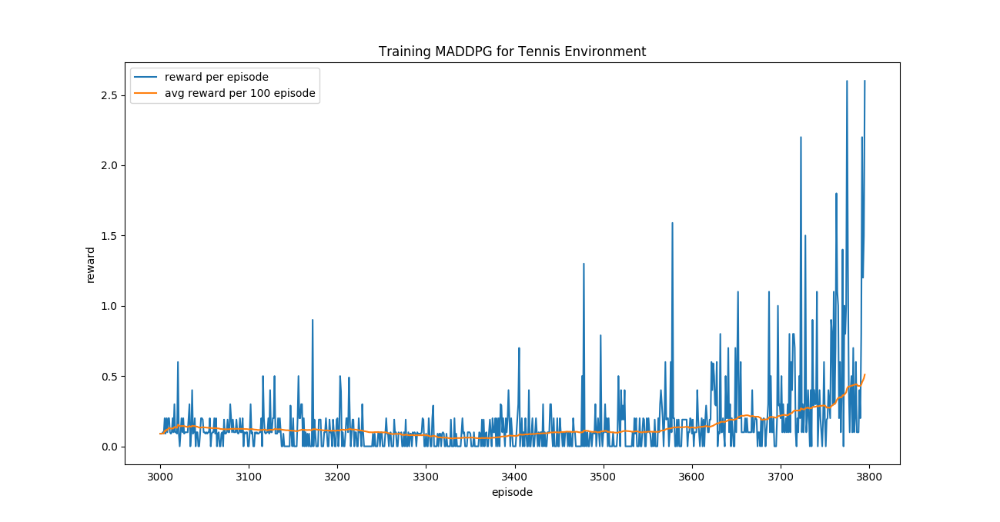
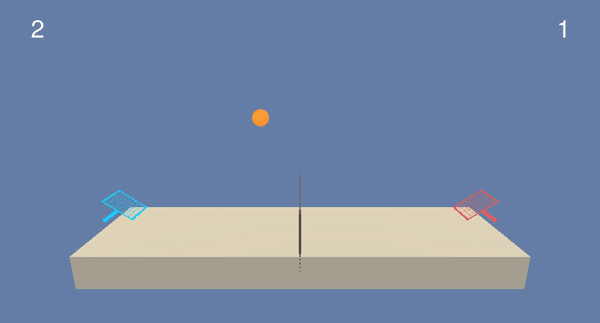

# Project Report

## About
In this project, we work with the Unity's [Tennis](https://github.com/Unity-Technologies/ml-agents/blob/master/docs/Learning-Environment-Examples.md#tennis) Environment.
In this environment, there are two agents which control rackets to bounce a ball over a net. The agent receives +0.1 reward if it manages to hit ball over the net without dropping or hitting out of bounds. For dropping or hitting out of bounds, it receives -0.01 .

The observation space consists of 24 variables representing position and velocity of the ball and racket. Each action is a vector with two numbers, corresponding to movement towards or away from the net, and jumping. The action vector should be a number between 1 and -1. 

The observation is a *2x24* dimensional vector and the action is *2x2*.

## Goal
The environment is deemed solved if the agents get an average score of +0.5 over 100 consecutive episodes.

## Algorithm - Multi-Agent Deep Deterministic Policy Gradient (MADDPG)
<p align= "center">
  
</p>

**Reference** - *[“Multi-Agent Actor-Critic for MixedCooperative-Competitive Environments” paper](https://arxiv.org/pdf/1706.02275.pdf)*

## Architecture
```
Actor(
  (fc1): Linear(in_features=24, out_features=256, bias=True)
  (fc2): Linear(in_features=256, out_features=128, bias=True)
  (fc3): Linear(in_features=128, out_features=2, bias=True)
)
Critic(
  (fcs1): Linear(in_features=48, out_features=256, bias=True)
  (fc2): Linear(in_features=260, out_features=128, bias=True)
  (fc3): Linear(in_features=128, out_features=1, bias=True)
)

```
## Constants & Hyperparams
```
NUM_AGENTS = 2
STATE_SIZE = 24
ACTION_SIZE = 2

NUM_TRAIN_EPISODES = 100000
NUM_TEST_EPISODES = 100

BUFFER_SIZE = int(1e5)  # replay buffer size
BATCH_SIZE = 256        # minibatch size
GAMMA = 0.99            # discount factor
TAU = 1e-3              # for soft update of target parameters
LR_ACTOR = 1e-3         # learning rate of the actor
LR_CRITIC = 3e-4        # learning rate of the critic
WEIGHT_DECAY = 0        # L2 weight decay
LEARN_NUM = 3          # number of learning passes

NOISE_START=1.0
NOISE_END=0.1
NOISE_REDUCTION=0.999
EPISODES_BEFORE_TRAINING = 300
EPISODE_START = 0

DEVICE = torch.device("cuda:0" if torch.cuda.is_available() else "cpu")
```
## Training Log
```
.
.
.
Noise Scaling: 0.1, Memory size: 51724 and Num Steps: 52
Episode 3787    Average Score: 0.43     Current Score: 0.10000000149011612
Noise Scaling: 0.1, Memory size: 51754 and Num Steps: 30
Episode 3788    Average Score: 0.43     Current Score: 0.10000000149011612
Noise Scaling: 0.1, Memory size: 51822 and Num Steps: 68
Episode 3789    Average Score: 0.43     Current Score: 0.4000000059604645
Noise Scaling: 0.1, Memory size: 51989 and Num Steps: 167
Episode 3790    Average Score: 0.43     Current Score: 0.20000000298023224
Noise Scaling: 0.1, Memory size: 52078 and Num Steps: 89
Episode 3791    Average Score: 0.44     Current Score: 0.800000011920929
Noise Scaling: 0.1, Memory size: 52399 and Num Steps: 321
Episode 3792    Average Score: 0.46     Current Score: 2.2000000327825546
Noise Scaling: 0.1, Memory size: 53242 and Num Steps: 843
Episode 3793    Average Score: 0.47     Current Score: 1.2000000178813934
Noise Scaling: 0.1, Memory size: 53694 and Num Steps: 452
Episode 3794    Average Score: 0.48     Current Score: 1.5000000223517418
Noise Scaling: 0.1, Memory size: 54281 and Num Steps: 587
Episode 3795    Average Score: 0.51     Current Score: 2.600000038743019
Noise Scaling: 0.1, Memory size: 55281 and Num Steps: 1000
Saved Model: Episode 3795       Average Score: 0.51

```

## Training curve
<p align= "center">
  
</p>


## Test output
<p align= "center">
  
</p>

## Conclusion
MADDPG agent was able to successfully solve the Reacher Environent in 419 episodes.

## Future Improvement
We can explore the Proximal Policy Optimization(PPO) algorithm in the Mult-Agent setting.